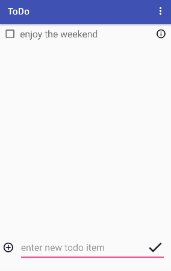

# Pre-work - simp**LIST**ic

simp**LIST**ic is an android app that allows building a todo list and basic todo items management functionality including adding new items, editing and deleting existing items. Users can also mark items as completed and achieve a sense of satisfaction! The design and functionality of this app is highly inspired from the todo list app that iOS has to offer. I personally feel that the design is pretty clean and simplified. Also, the users can use the app from the get-go without figuring out how the app works.

Submitted by: **Kiran Karpurapu**

Time spent: **16** hours spent in total

## User Stories

The following **required** functionality is completed:

* [Y] User can **successfully add and remove items** from the todo list
* [Y] User can **tap a todo item in the list and bring up an edit screen for the todo item** and then have any changes to the text reflected in the todo list.
* [Y] User can **persist todo items** and retrieve them properly on app restart

The following **optional** features are implemented:

* [Y] Persist the todo items [into SQLite](http://guides.codepath.com/android/Persisting-Data-to-the-Device#sqlite) instead of a text file
* [Y] Improve style of the todo items in the list [using a custom adapter](http://guides.codepath.com/android/Using-an-ArrayAdapter-with-ListView)
* [Y] Add support for completion due dates for todo items (and display within listview item)
* [N] Use a [DialogFragment](http://guides.codepath.com/android/Using-DialogFragment) instead of new Activity for editing items : *My UI design looks better if I have a new activity for editing items.*
* [Y] Add support for selecting the priority of each todo item (and display in listview item)
* [Y] Tweak the style improving the UI / UX, play with colors, images or backgrounds

The following **additional** features are implemented:

* [Y] Ability to mark an item as completed. Just tap on the item or the check box to the left of the item.
* [Y] Ability to delete an item. Just swipe left on the item.
* [Y] Ability to quickly add an item without filling all the details and ability to add an item after specifying all the details. This increases the usability of the app as not always everybody wants to fill all the details before saving the item.
* [Y] Ability to write some notes about an item. This will help the user record more information about the item.

## Video Walkthrough

Here's a walkthrough of implemented user stories:

## Project Analysis

As part of your pre-work submission, please reflect on the app and answer the following questions below:

**Question 1:** "What are your reactions to the Android app development platform so far? Compare and contrast Android's approach to layouts and user interfaces in past platforms you've used."

**Answer:** I really liked making android applications. I have a feeling that I can convert all the simple and useful ideas that I get now can be converted into tangible mobile applications. I am natively a backend developer in java. I have no previous experience of doing front-end before I started doing android. I really like the concept of layouts and binding them to activites. The relation is stated very clearly and nothing is hidden or complicated.

**Question 2:** "Take a moment to reflect on the `ArrayAdapter` used in your pre-work. How would you describe an adapter in this context and what is its function in Android? Why do you think the adapter is important? Explain the purpose of the `convertView` in the `getView` method of the `ArrayAdapter`."

**Answer:** I feel the adapter is a source of configuration and data for the recycler view I used in the app. It is the adapter that lets the developer send and configure the data that needs to be displayed on the recycler view. The adapter also lets the user interact with the list by supporting various UI event listeners. Also because I was using a recycler view adapter, I did not have to an array adapter. recycler view adapter exposes several handy methods that can be overidden to inflate our custom layouts and bind data to them.

## Notes

Describe any challenges encountered while building the app.

I am used to saving data in NO-SQL databases by making API calls and querying them using concepts different from SQL. Working with DBFlow (a wrapper around SQLite) was something new for me and I had to invest a considerable amount of time to wrap my head around it. Also mimicking the UI from the iOS app was also challenging.

## License

    Copyright [2017] [kirankarpurapu]

    Licensed under the Apache License, Version 2.0 (the "License");
    you may not use this file except in compliance with the License.
    You may obtain a copy of the License at

        http://www.apache.org/licenses/LICENSE-2.0

    Unless required by applicable law or agreed to in writing, software
    distributed under the License is distributed on an "AS IS" BASIS,
    WITHOUT WARRANTIES OR CONDITIONS OF ANY KIND, either express or implied.
    See the License for the specific language governing permissions and
    limitations under the License.